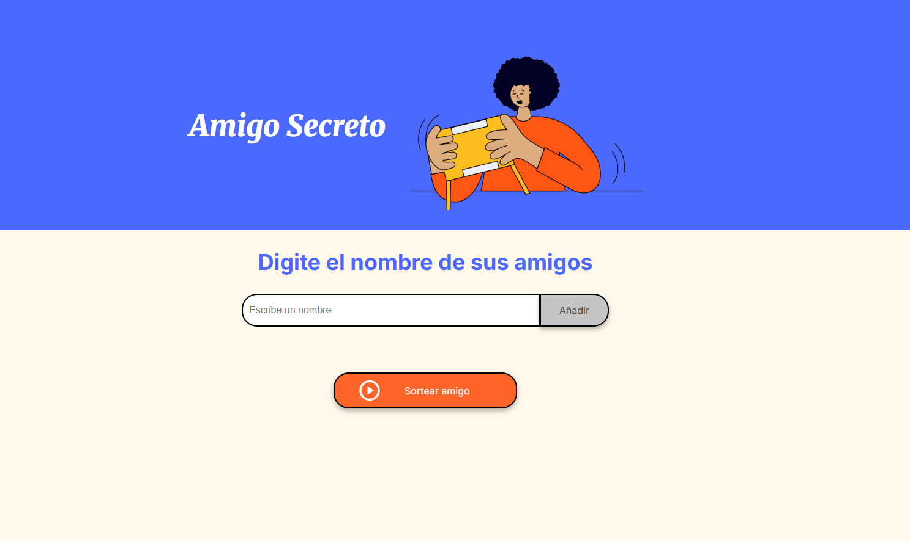

<h1 align="center">🎁 Amigo Secreto</h1>

  Proyecto de práctica de lógica de programación con <b>JavaScript</b>, <b>Git y GitHub</b>.  

---

## 📋 Descripción
Esta aplicación permite a los usuarios:
1. Ingresar nombres de amigos en una lista.
2. Mostrar dinámicamente los nombres en la interfaz.
3. Realizar un sorteo aleatorio para determinar el **amigo secreto**.

Es un proyecto práctico del programa ONE (Oracle Next Education) con Alura Latam, enfocado en mejorar la lógica de programación y el uso de Git/GitHub.

---

## 🚀 Estado del proyecto
✅ Versión inicial completada  
⚙️ En mejora continua  

---

## 🔨 Funcionalidades
- `Agregar nombres`: Permite añadir nombres a una lista visible en pantalla.
- `Visualizar lista`: Muestra en pantalla los amigos ingresados.
- `Sorteo aleatorio`: Selecciona un nombre al azar con `Math.random()` y `Math.floor()`.

---

## 🖥️ Vista previa
Ejemplo de la interfaz del proyecto:

---

## 📂 Acceso al proyecto
Puedes acceder al código fuente en este repositorio o clonar el proyecto:  

bash
`git clone https://github.com/ccetraro85/challenge-amigo-secreto-alluraONE.git`

Luego abre index.html en tu navegador.

---

## 🛠️ Tecnologías utilizadas

JavaScript – Lógica de programación.

HTML5 – Estructura de la aplicación.

CSS3 – Estilos y diseño.

Git/GitHub – Control de versiones.

---

## 👩‍💻 Autora
 Cynthia Cetraro

---

## 📜 Licencia

Este proyecto se distribuye bajo la licencia MIT.
¡Siéntete libre de usarlo, modificarlo y compartirlo!

✨ Desarrollado como parte del programa ONE – Oracle Next Education y Alura Latam.
